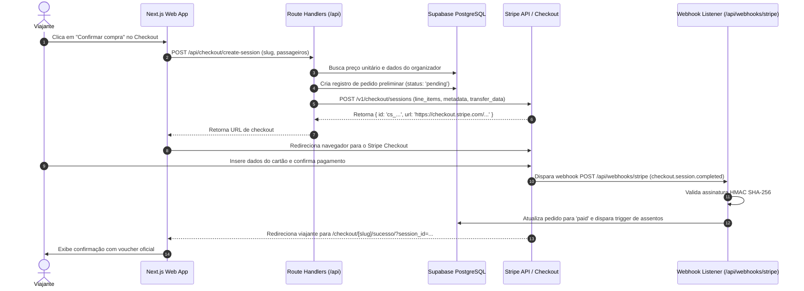

# Design Técnico e Arquitetural — FEAT-002: Stripe Integration & Live Payments

---

## 1. Arquitetura da Integração



---

## 2. Configurações e Variáveis de Ambiente

```env
NEXT_PUBLIC_STRIPE_PUBLISHABLE_KEY="pk_test_..."
STRIPE_SECRET_KEY="sk_test_..."
STRIPE_WEBHOOK_SECRET="whsec_..."
PLATFORM_FEE_PERCENT="0"
```

---

## 3. Estrutura de Split e Transferências
- **Modelo de Cobrança**: Cobrança direta com transferência de destino (`payment_intent_data.transfer_data.destination = organizer_stripe_account_id`).
- **Comissão da Plataforma**: Retida via `application_fee_amount = total * (PLATFORM_FEE_PERCENT / 100)`.
- **Prevenção de Falhas**: Se o organizador ainda não tiver conta Stripe conectada, a plataforma retém o valor integral e agenda o repasse no painel financeiro para processamento posterior.
