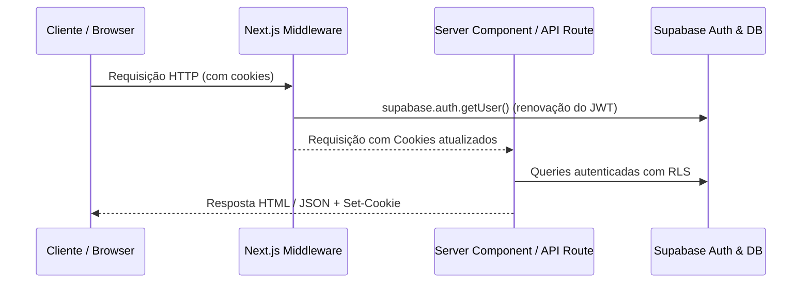

# Design Técnico e Arquitetura — FEAT-003: Prontidão para Produção

- **Feature**: FEAT-003 (Production Readiness & Live Data Finalization)
- **Status**: `APPROVED`
- **Data**: 2026-08-17

---

## 1. Arquitetura de Sessão e SSR



### 1.1. Middleware (`apps/web/middleware.ts`)
- Utiliza `createServerClient` de `@supabase/ssr` passando `request.cookies` e manipulando `response.cookies`.
- Executa em todas as rotas com exceção de arquivos estáticos (`_next`, `assets`, `icons`, `images`).
- Gerencia redirecionamentos de rotas protegidas:
  - `/organizador/*` requer usuário autenticado com `role = 'organizer'`.
  - `/minhas-excursoes/*` e `/minha-conta/*` requerem usuário autenticado.

### 1.2. AuthContext (`apps/web/lib/auth-context.tsx`)
- Componente cliente que inicializa o estado de autenticação a partir da chamada `/api/auth/me` e escuta eventos de mudança de autenticação do Supabase Browser Client.
- Fornece:
  ```typescript
  type AuthContextType = {
    user: User | null;
    profile: ProfileRecord | null;
    isLoading: boolean;
    signOut: () => Promise<void>;
    refresh: () => Promise<void>;
  };
  ```

---

## 2. Estratégia de Eliminação de Mocks

1. **Estado Inicial Limpo**:
   - `initialOrganizerProfile` em `profile-dashboard-data.ts` terá campos em branco (ou vazios) em vez de dados fictícios.
   - `TravelerAccount` inicia com campos em branco até o carregamento do perfil real do usuário.
2. **Estados Vazios Elegantes**:
   - Substituição de fallbacks em memória por componentes `<EmptyState />` com botão de ação contextual.
3. **Limpeza de Textos de Simulação**:
   - Remoção de todos os disclaimers de protótipo em `auth-shell.tsx`, `checkout-flow.tsx` e `new-excursion-journey.tsx`.

---

## 3. Seed e Catálogo de Produção

- Script de população com excursões brasileiras com destinos reais (Capitólio, Bonito, Arraial do Cabo, Lençóis Maranhenses, Holambra, Foz do Iguaçu), dados de embarque, horários, preços e roteiros completos.
